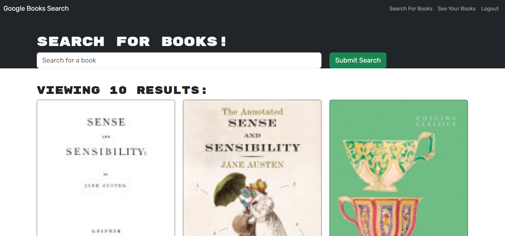

# Book-Search-Engine
Google Books API search engine built with GraphQL and Apollo Server. The app uses the MERN stack, with a React front end, MongoDB database, and Node.js/Express.js server. 
## Table of Contents
- [Installation](#installation)
- [Usage](#usage)
- [Credits](#credits)
- [License](#license)
- [Badges](#badges)
- [Tests](#tests)
- [Questions](#questions)

## Installation
N/A

## Usage
You can use this application by clicking [here](https://pure-beach-47354-82ea34555a5e.herokuapp.com/).  
Visiting the link above will open the application which will display the following:  
     
You can search for books using the Google Books API prior to logging in or creating an account, but you will need to login/sign up in order to save books or delete previously saved books.  
     
     

## Credits
Worked with tutor Chris Baird and instructor Tyler Calvert to debug functions and complete Apollo server and GraphQL configuration.

## License
MIT License

## Badges

## Tests
N/A 

## Questions
GitHub Profile: [github.com/shannonkprice00](https://github.com/shannonkprice00) 
For further questions, you can reach me at shannonkprice00@gmail.com